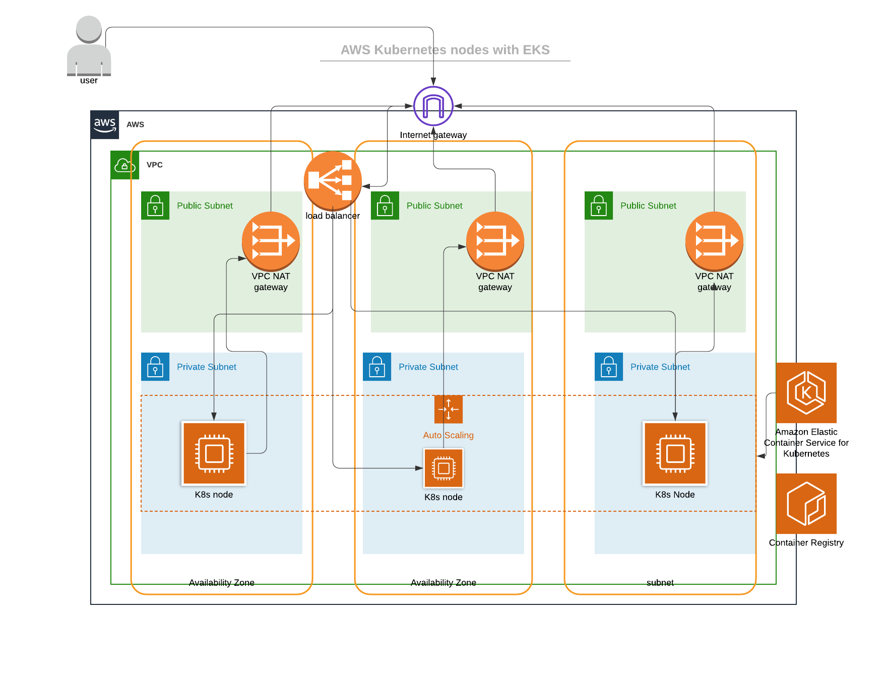

## Terraform Configuration for Hello World App
This Repo will deploy the infrastructure needed to Deploy the Hello World microservice in AWS using using circleci. It will apply init/validate/apply terraform. The output generated by terraform is the Container Registry uri which will be used to update the .circleci AWS_ECR_ACCOUNT_URL in the app repo.
Due to the open end nature of the task, i wanted to use EKS instead of ECS as SuperAwesome are using it. I personally really enjoyed working on this task  especially learning and using CircleCI as i hadn't used it before and knowing there are number of ways to do, i wanted to show my understanding of the cloud infrastructure and software development.

## Architecture 

## Technologies:
- AWS EKS
- AWS ECR
- AWS Autoscaling Group
- AWS VPC
- AWS IAM
- AWS EC2

## Prerequisites

- terraform > 0.12	
- awscli
- aws existing key pair (test.pem) in this case
- aws s3 bucket (if state files are to be stored remotely. RECOMMENDED)

## Configure environment variables on CircleCI
The following [environment variables](https://circleci.com/docs/2.0/env-vars/#setting-an-environment-variable-in-a-project) must be set for the project on CircleCI via the project settings page, before the project can be built successfully.

| Variable                       | Description                                               |
| ------------------------------ | --------------------------------------------------------- |
| `AWS_ACCESS_KEY_ID`            | Used by the AWS CLI                                       |
| `AWS_SECRET_ACCESS_KEY `       | Used by the AWS CLI                                       |
| `AWS_REGION`                   | Used by the AWS CLI. Example value: "us-east-1"           |
| `APP_BUCKET`                   | S3 bucket name to store the state of the terraform run    |

- It will also give and output.txt file which will be used to configure the app circleci config and its env variables.

## Caveats/Notes

- I tested the infrastructure using AWS region us-east-1 in circleci using the yaml file given in the .circleci dir but can be ran locally as well by configuring using the aws cli.

- Needs a predifined aws ssh key "test.pem" which can be changed if required.

- S3 bucket to store the state of the terraform runs

- if ran locally, use the ./start.sh script to build and ./destroy.sh to destroy the env

